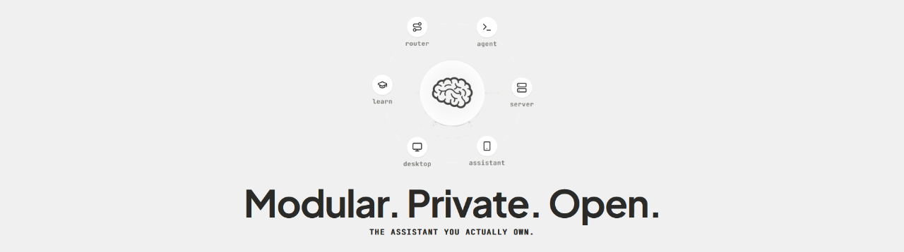
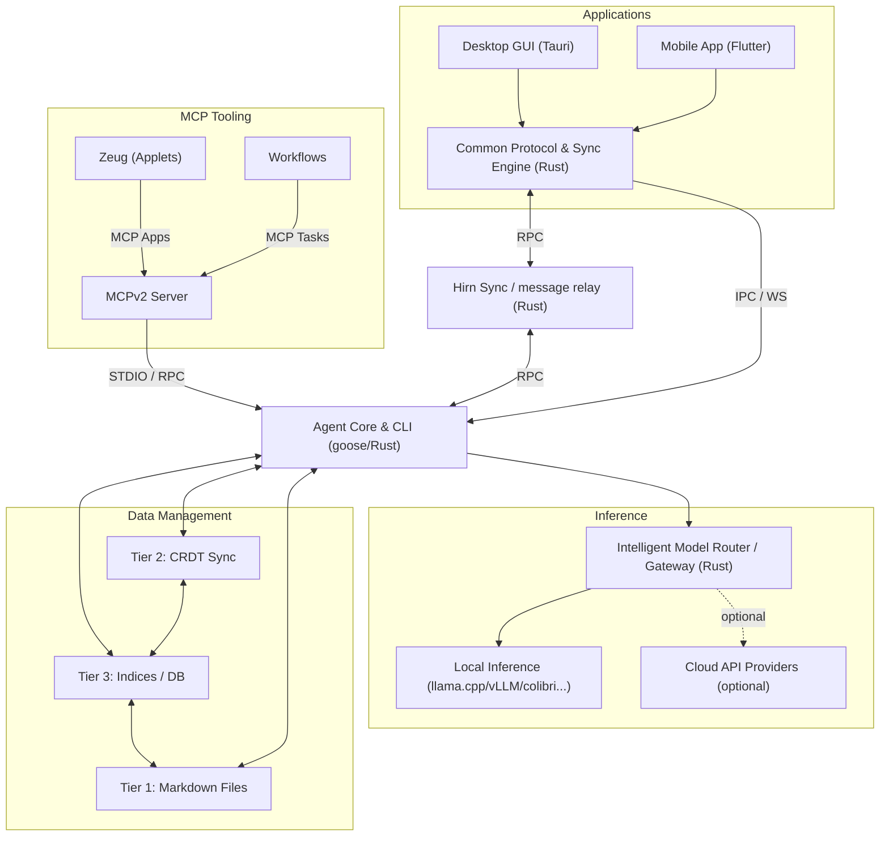

# Hirn - The assistant you actually own

<p align="center">
  <picture>
    
  </picture>
</p>

<p align="center">
  <a href="https://github.com/hirnlabs/hirn/actions"></a>
  <a href="https://matrix.to/#/#hirnlabs:matrix.org"></a>
  <a href="https://github.com/hirnlabs/hirn/releases"></a>
  <a href="https://github.com/hirnlabs/hirn/stargazers"></a>
  <a href="LICENSE"></a>
  <a href="#desktop-application-gui"></a>
  <a href="./router"></a>
  <a href="./desktop/src-tauri"></a>
  <a href="./desktop"></a>
  <a href="./assistant"></a>
  <a href="./sdk"></a>
  <a href="./homepage"></a>
</p>


Hirn ([hɪʁn](https://upload.wikimedia.org/wikipedia/commons/9/91/De-Hirn.ogg?utm_source=de.wiktionary.org) German for brain) is a composable, private, local-first AI agent ecosystem that, by default, runs 100% private natively on your own hardware. Built around a local storage hierarchy and local [MCPv2 Servers](https://modelcontextprotocol.io/) as Extensions(called Zeug, [t͡sɔɪ̯k](https://upload.wikimedia.org/wikipedia/commons/0/09/De-Zeug.ogg?utm_source=de.wiktionary.org&utm_campaign=index&utm_content=original) , german for useful thing) the [Agent Client Protocol (ACP)](https://agentclientprotocol.com), Hirn connects apps, terminal interfaces, mobile clients, and local inference servers with [RPC](https://wikipedia.org/wiki/Remote_procedure_call) through an intelligent router and encrypted P2P signaling network with zero cloud lock-in and zero 3rd party services by design.

[Website](https://agent.hirn-labs.com) · [Docs](https://hirn-labs.com/docs) · [Web App](https://client.hirn-labs.com/) · [Desktop App](#desktop-application-gui) · [Agent CLI](#agent-cli-headless--standalone) · [Architecture](#how-it-fits-together) · [License](LICENSE)

---

## Install

Hirn supports macOS, Linux, and Windows. You can run the full-featured Desktop GUI or the standalone Agent CLI (or both).

### Desktop Application (GUI)

Download pre-built desktop installers for your operating system directly from [GitHub Releases](https://github.com/hirnlabs/hirn/releases):

- **macOS**: Download `.dmg` disk image.
- **Windows**: Download `.msi` or `.exe` installer.
- **Linux**: Download `.AppImage` or `.deb` package.

> **Automatic Updates**: Desktop installations automatically check for updates on startup, download release updates in the background, and prompt to restart.

---

### Agent CLI (Headless / Standalone)

The Hirn Agent is a Rust-based ACP orchestration engine and CLI tool based on the (gooose agent)[https://github.com/aaif-goose/goose] by the (Agentic AI Foundation (AAIF))[https://aaif.io/] at the Linux Foundation. 

The setup scripts automatically detect your OS/architecture, provision `~/.hirn/bin`, and configure PATH.

```bash
# macOS / Linux / WSL2
curl -fsSL https://raw.githubusercontent.com/hirnlabs/hirn/main/agent/setup/install.sh | bash
```

```powershell
# Windows PowerShell
irm https://raw.githubusercontent.com/hirnlabs/hirn/main/agent/setup/install.ps1 | iex
```

To install a specific version tag:
```bash
# macOS / Linux
curl -fsSL https://raw.githubusercontent.com/hirnlabs/hirn/main/agent/setup/install.sh | bash -s -- --version v0.1.0
```
```powershell
# Windows PowerShell
$script = [scriptblock]::Create((irm https://raw.githubusercontent.com/hirnlabs/hirn/main/agent/setup/install.ps1))
& $script -Version v0.1.0
```

---

### Standalone Web Client (Docker)

Deploy the Web Client as a lightweight Nginx/SvelteKit Docker container, you can then connect to the CLI agent via WebSocket:

```bash
docker run -d \
  -p 80:80 \
  --name hirn-web \
  ghcr.io/hirnlabs/desktop-web:latest
```

---

## Quick start

### 1. Verify Setup & Configure Models
```bash
hirn doctor
hirn configure
```

### 2. Launch Terminal Sessions
```bash
# Interactive Chat Session
hirn session

# Terminal UI (TUI)
hirn tui
```

### 3. Connect Desktop & Web Bridge
Launch the **Hirn Desktop App** for multi-agent chat, non-blocking background execution, interactive tool UIs (`ext-apps`), and encrypted WebRTC P2P sync.

```bash
hirn desktop
```

To start an ACP server over WebSocket and HTTP for Web Client or remote tool connections:
```bash
hirn serve
```

---

## How it fits together



- **[Desktop Host](./desktop)**: Tauri v2 + SvelteKit multi-agent host with dual-mode transports (Tauri IPC, WebSocket, WebRTC P2P) and sandboxed interactive tool UIs (`ext-apps`).
- **[Agent CLI](./agent)**: Rust-based ACP orchestration engine, terminal UI (`tui`), and WebRTC ACP relay server.
- **[Router & Server](./router)**: Intelligent local-first gateway routing prompts based on task complexity and VRAM/hardware capability across local llama.cpp / vLLM backends and optional cloud model providers.
- **[Signaling & Relay Server](./signaling)**: Minimal Rust WebRTC server providing encrypted P2P synchronization and store-and-forward message queuing for async offline delivery across devices.
- **[Storage Hierarchy (Tier 1-3)](./data)**: Canonical human-readable files (Markdown/JSON), binary CRDT collaboration overlays, and SQLite, Grafeo graph knowledge, and Vector DB queryable indices.
- **[Assistant & Transcribe](./assistant)**: Mobile companion app (Flutter + Rust Sync Core) and local privacy-first speech-to-text engine using Whisper.

---

## Security & Privacy

- **100% Local-First**: Sessions and configurations are persisted locally in `~/.hirn` and your file system. No unexpected cloud telemetry.
- **Sandboxed Tool UIs**: Interactive extension UIs run in isolated, sandboxed views with zero open HTTP ports.
- **Encrypted Relay**: WebRTC P2P sync uses encrypted store-and-forward message queues for secure inter-device communication.
- **Configurable Endpoints**: Swap signaling and relay endpoints to self-hosted instances seamlessly across Desktop UI, Agent CLI, and Mobile Assistant.

---

## Documentation

| Module                         | Description                                                             | Guide |
| :----------------------------- | :---------------------------------------------------------------------- | :---- |
| [`desktop`](./desktop)         | Tauri v2 + Svelte 5 multi-agent Desktop GUI & Web host                  | [Desktop Readme](./desktop/README.md) |
| [`agent`](./agent)             | Rust ACP orchestration engine, CLI & WebRTC relay server                | [Agent Readme](./agent/README.md) |
| [`assistant`](./assistant)     | Flutter + Rust Sync Core mobile client for on-the-go access             | [Assistant Readme](./assistant/README.md) |
| [`router`](./router)           | Intent classification & local-first model routing gateway               | [Router Readme](./router/README.md) |
| [`server`](./server)           | RPC model host with VRAM sharding & distributed inference               | [Server Readme](./server/README.md) |
| [`data`](./data)               | Tier 1-3 storage hierarchy (Markdown, SQLite, Vector DB, Grafeo Graph)  | [Data Readme](./data/README.md) |
| [`signaling`](./signaling)     | WebRTC signaling server & encrypted store-and-forward relay             | [Signaling Readme](./signaling/README.md) |
| [`transcribe`](./transcribe)   | Private local Whisper speech-to-text engine                             | [Transcribe Readme](./transcribe/README.md) |
| [`sdk`](./sdk)                 | TypeScript SDK for building custom modular tools & extensions          | [SDK Readme](./sdk/README.md) |
| [`homepage`](./homepage)       | Astro web & documentation portal                                        | [Homepage Readme](./homepage/README.md) |

---

## Development

The repository combines Rust and Web components across desktop, CLI, and web apps.

```bash
# Clone the repository
git clone https://github.com/hirnlabs/hirn.git
cd hirn

# Build Agent CLI (Rust)
cd agent
cargo build --release

# Run Desktop Application in development (Bun + Tauri v2)
cd ../desktop
bun install
bun tauri dev
```

See [CONTRIBUTING.md](CONTRIBUTING.md) for contribution guidelines, development workflow, and commit conventions.

---

## Commercial Licensing & Business Model

Hirn is built for user sovereignty and private local computation, not for commercial applications.

- **Individual & Non-Commercial Use**: Hirn is free for personal and non-commercial use. Some features are locked, but can easily be self-hosted or replaced with open-source alternatives.
- **Commercial Usage of any Kind**: Requires a valid **License Key** (one-time purchase) or an active **Hirn Sync Subscription**.
- **Open Source & Self-Hostable**: The entire software stack including the signaling Protocol, SDKs and encrypted relay server is 100% open source and self-hostable. 
 
> You do not need the subscription to use all the features, but the subscription provides a convenient way to access the relay server and keep your devices in sync without running your own infrastructure.

See [LICENSE](LICENSE) for full licensing details and Terms of Use.
