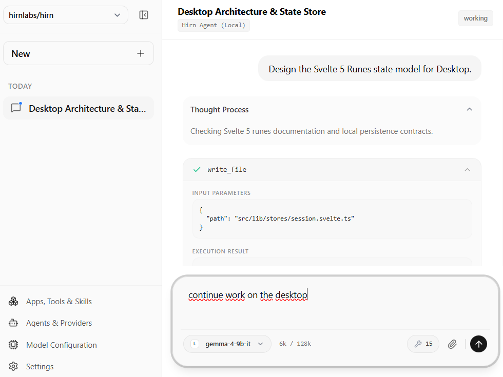

# Hirn Desktop

The cross-platform Desktop GUI and Modular Tool Host for Hirn. Built with **Tauri v2**, **Svelte 5**, and **TypeScript**.



Hirn Desktop provides a high-density, minimal interface (inspired by Linear and Anytype) for interacting with multiple Agent Client Protocol (ACP) agents simultaneously — whether running locally on your computer, on your local network, or securely over P2P.

---

## Key Capabilities

- **Multi-Agent Chat**: Connect to multiple local (`hirn acp`, `goose`, `claude`) and remote ACP agents in a single unified interface.
- **Dual-Mode Transports**: Run as a native Tauri desktop app (direct process execution) or as a standalone Web application (connecting via `hirn serve`).
- **Auto-Update on Startup**: Desktop installations automatically check for updates on startup via Tauri's native updater plugin and prompt for seamless restart.
- **Shared Session Storage**: Session history is persisted at `~/.hirn/sessions/`, keeping chat history 100% in sync between the Hirn CLI and Desktop app.
- **Non-Blocking Execution**: Switch between sessions seamlessly while background agents continue thinking, streaming responses, or running tools.
- **Modular Tool Host**: Renders interactive tool UIs (`ext-apps` / MCP Apps) inside sandboxed views with zero open HTTP ports.
- **P2P Sync & Encrypted Queue**: Multi-device WebRTC P2P sync with encrypted store-and-forward message queuing for async offline delivery across devices.

---

## Licensing & Business Model

- **Individual & Non-Commercial Use**: Hirn is free for personal and non-commercial use.
- **Commercial Usage**: Requires a valid **License Key** (one-time purchase) or an active **Hirn Sync Subscription**.
- **Open Source & Self-Hostable**: The signaling and encrypted relay server is 100% open source and self-hostable.
- **Exchangeable Relay Endpoint**: The relay server URL (defaulting to `https://agent.hirn-labs.com`) can be easily configured or swapped for a self-hosted instance in the **Desktop UI**, **Agent CLI**, and **Mobile Assistant**.

---

## Installation & Updates

### Desktop Application (Installers)

Download pre-built desktop installers directly from [GitHub Releases](https://github.com/hirnlabs/hirn/releases):

- **Windows**: Download `.msi` or `.exe` installer.
- **macOS**: Download `.dmg` disk image.
- **Linux**: Download `.AppImage` or `.deb` package.

#### Updating Desktop Installations
- **Automatic**: On startup, Desktop automatically checks GitHub Releases for new versions via `tauri-plugin-updater`, downloads the update in the background, and prompts to restart.
- **Manual**: Download and run the latest installer from GitHub Releases to overwrite the binary.

### Standalone Web Client (Docker)

Deploy the Web Client as a lightweight Nginx/SvelteKit Docker container:

```bash
docker run -d \
  -p 80:80 \
  --name hirn-web \
  ghcr.io/hirnlabs/desktop-web:latest
```

*Note: Web deployments update automatically whenever the Docker container image is updated.*

---

## Getting Started

### Prerequisites

- [Bun](https://bun.sh/) (`v1.0` or higher)
- [Rust](https://www.rust-lang.org/) (for Tauri desktop builds)

### Development

1. **Install dependencies**:
   ```bash
   bun install
   ```

2. **Run Web UI in development mode**:
   ```bash
   bun dev
   ```
   Open `http://localhost:1420` in your browser.

3. **Run Tauri Desktop app in development mode**:
   ```bash
   bun tauri dev
   ```

4. **Build production bundle**:
   ```bash
   bun tauri build
   ```

---

## How It Works

```
┌────────────────────────────────────────────────────────────────────────┐
│                          HIRN DESKTOP (Svelte 5)                       │
│  ┌───────────────────────┐                    ┌──────────────────────┐ │
│  │   Sidebar Sessions    │                    │  Central Chat View   │ │
│  │  (Working / Waiting)  │                    │  (Tool Execution)    │ │
│  └───────────┬───────────┘                    └───────────┬──────────┘ │
└──────────────┼────────────────────────────────────────────┼────────────┘
               │                                            │
               ▼                                            ▼
┌────────────────────────────────────────────────────────────────────────┐
│                             AcpClientSession                           │
│              (ACP Initialize Handshake & Message Streaming)            │
└───────────────────────────────────┬────────────────────────────────────┘
                                    │
         ┌──────────────────────────┼──────────────────────────┐
         ▼                          ▼                          ▼
 ┌───────────────┐          ┌───────────────┐          ┌───────────────┐
 │TauriIpcTransp │          │WebSocketTransp│          │P2pWebRtcTransp│
 │(Local Process)│          │(Network/Serve)│          │(P2P Sync)     │
 └───────────────┘          └───────────────┘          └───────────────┘
```

For detailed internal architecture and domain vocabulary, see [CONTEXT.md](./CONTEXT.md).
