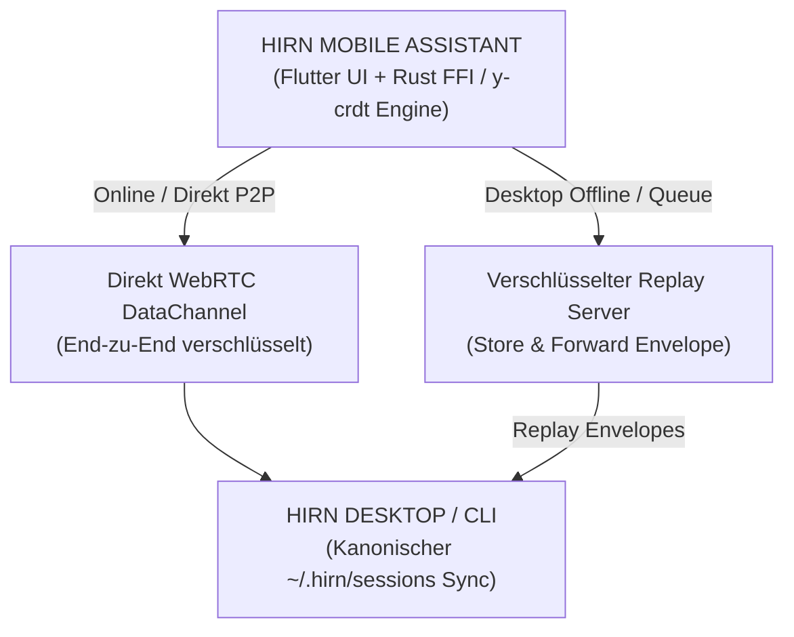

## Echtzeit CRDT & Verschlüsselte P2P-Synchronisation

Die mobile App **assistant** gibt dir von überall auf der Welt die volle Kontrolle über dein hirn-Ökosystem, ohne dass private Daten an fremde Server übertragen werden.



### 1. Conflict-Free Replicated Data Types (y-crdt)
Arbeite offline in der U-Bahn, im Flugzeug oder bei Netzunterbrechungen. Sämtliche Sitzungsverläufe, ausstehende Werkzeugaufrufe und Benutzereingaben werden lokal über `y-crdt` Statusvektoren nachverfolgt. Sobald Geräte wieder online sind, verschmelzen die Daten automatisch ohne Konflikte oder Datenverlust.

### 2. End-zu-End verschlüsselte Replay-Warteschlange
Wenn dein Desktop-Computer ausgeschaltet oder nicht erreichbar ist:
- Die mobile App signiert und verschlüsselt Status-Umschläge lokal mit SHA-256 / AES-GCM Schlüsselpaaren.
- Die Umschläge werden an einen quelloffenen Zero-Knowledge Relay-Server (`https://agent.hirn-labs.com` oder selbstgehostet) übermittelt.
- Der Relay-Server kann weder Inhalte entschlüsseln noch Metadaten lesen.
- Sobald dein Desktop wieder online geht, ruft er die bereitstehenden Umschläge ab, entschlüsselt sie lokal und spielt den CRDT-Statusvektor ein.

## Hochleistungs-Engine mit Flutter + Rust

Nativ entwickelt für Android und iOS mit **Flutter** für eine flüssige Benutzeroberfläche und **Rust FFI** für kryptographische Operationen, lokalen Speicher und CRDT-Berechnungen.

- **0 Offene HTTP-Ports:** Modulare MCP Apps (`ext-apps`) laufen in mobilen Webviews über native Protokoll-Handler (`WebViewAssetLoader` unter Android, `WKURLSchemeHandler` unter iOS) unter `hirn://apps/<app-id>/index.html`.
- **Hintergrund-Push & Offloading:** Erhalte sofortige Benachrichtigungen bei Fertigstellung von Hintergrundaufgaben oder lagere aufwendige Berechnungen an lokale hirn-Server aus.
- **Selbsthostbare Infrastruktur:** Der Signaling- und Replay-Server ist 100% Open-Source und einfach auf jedem VPS einsatzbereit:
  ```bash
  docker run -d -p 8080:8080 ghcr.io/hirnlabs/signaling:latest
  ```
