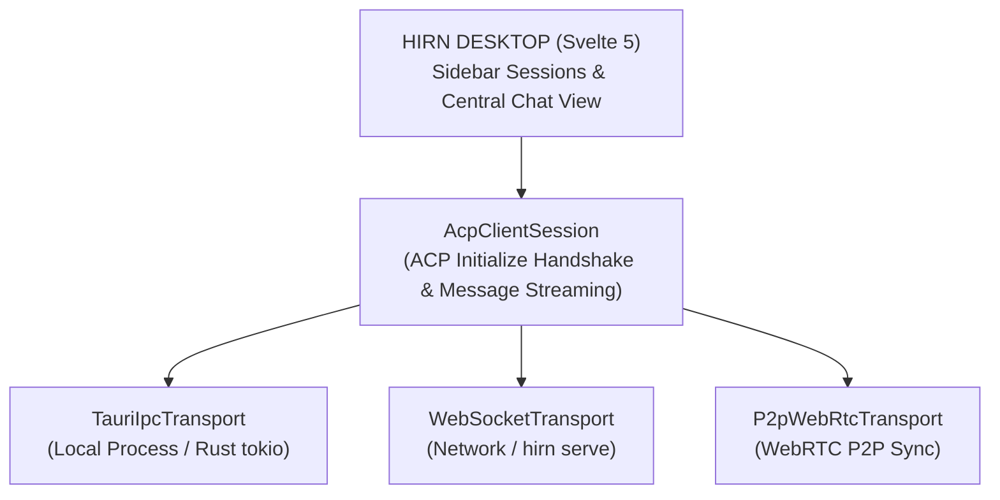

## Zentraler Multi-Agenten-Workspace

Hirn Desktop bietet eine übersichtliche, minimale Benutzeroberfläche zur simultanen Orchestrierung mehrerer Agent Client Protocol (ACP) Agenten-Sitzungen, egal ob lokal auf deinem Computer, im lokalen Netzwerk oder über verschlüsselte P2P-Verbindungen.

- **Unterbrechungsfreie Hintergrund-Ausführung:** Wechsle nahtlos zwischen Agenten-Sitzungen, während Hintergrund-Agenten weiterdenken, Antworten streamen oder Tools ausführen.
- **Sitzungsstatus-Indikatoren:** Echtzeit-Statusanzeigen für `idle`, `working` (pulsierender Status), `waiting_for_input` (Rechte-Freigaben) und `error`.
- **Kanonischer Sitzungsspeicher:** Alle Sitzungen werden direkt unter `~/.hirn/sessions/<session_id>.json` gespeichert und teilen eine einheitliche Datenquelle für CLI, Desktop und Web.

## Transportschicht-Architektur (Dual-Mode)

Angetrieben von einer abstrakten `AcpTransport`-Schnittstelle wechselt die Benutzeroberfläche nahtlos zwischen verschiedenen Ausführungsmodi:



- **Tauri IPC Transport (`TauriIpcTransport`):** Führt lokale ACP-Agenten-Prozesse direkt über Rust `tokio::process`-Pipes (`stdin`/`stdout`) aus und überträgt Newline-Delimited JSON (NDJSON) über Tauri-IPC.
- **WebSocket Bridge (`WebSocketTransport`):** Verbindet sich mit `hirn serve` oder Netzwerk-Endpunkten über `ws://` / `wss://` für browserbasierte Workflows.
- **P2P WebRTC Sync (`P2pWebRtcTransport`):** Ermöglicht verschlüsselte Peer-to-Peer Agenten-Verbindungen mit Store-and-Forward Nachrichtenwarteschlangen über verschiedene Geräte hinweg.

## Isolierter MCP Tool Host (`hirn://`)

Hirn Desktop agiert als modularer Host für interaktive Werkzeug-Oberflächen (MCP Apps). Über eigene native URI-Schemata (`tauri::UriScheme`) werden lokale App-Pakete sicher unter `hirn://apps/<app-id>/index.html` ohne offene HTTP-Ports bereitgestellt.

## Installation & Deployment

### Native Desktop-Installer

Vorkompilierte Installer stehen auf GitHub Releases zur Verfügung:

- **Windows:** `.msi` oder `.exe` Installer.
- **macOS:** `.dmg` Disk-Image.
- **Linux:** `.AppImage` oder `.deb` Paket.

### Standalone Web Container (Docker)

Starte den Svelte 5 Web Client als leichtgewichtigen Container:

```bash
docker run -d \
  -p 80:80 \
  --name hirn-web \
  ghcr.io/hirnlabs/desktop-web:latest
```
