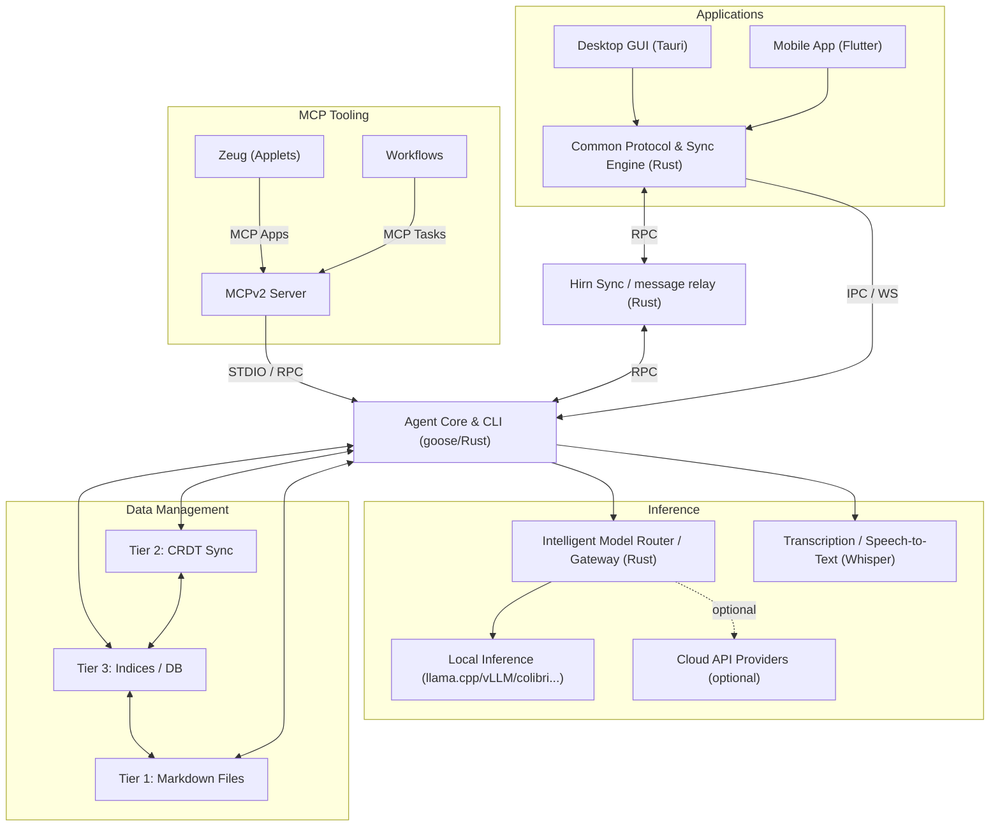

## Installation

Hirn unterstützt macOS, Linux und Windows. Du kannst die vollständige Desktop-GUI oder das eigenständige Agenten-CLI ausführen (oder beides).

### Desktop-Anwendung (GUI)

Lade vorkompilierte Desktop-Installer für dein Betriebssystem direkt von [GitHub Releases](https://github.com/hirnlabs/hirn/releases/latest) herunter:

- **macOS:** `.dmg` Disk-Image.
- **Windows:** `.exe` oder `.msi` Installer.
- **Linux:** `.AppImage` oder `.deb` Paket.

> **Automatische Updates:** Desktop-Installationen prüfen beim Start automatisch auf Updates, laden Releases im Hintergrund herunter und bieten einen Ein-Klick-Neustart an.

---

### Agenten-CLI (Headless / Standalone)

Der Hirn Agent ist eine Rust-basierte ACP-Orchestrierungsengine und ein CLI-Tool.

```bash
# macOS / Linux / WSL2
curl -fsSL https://raw.githubusercontent.com/hirnlabs/hirn/main/agent/setup/install.sh | bash
```

```powershell
# Windows PowerShell
irm https://raw.githubusercontent.com/hirnlabs/hirn/main/agent/setup/install.ps1 | iex
```

---

### Standalone Web-Client (Docker)

Starte den Web-Client als leichtgewichtigen Nginx/SvelteKit Docker-Container:

```bash
docker run -d \
  -p 80:80 \
  --name hirn-web \
  ghcr.io/hirnlabs/desktop-web:latest
```

---

## Schnellstart

### 1. Setup prüfen & Modelle konfigurieren
```bash
hirn doctor
hirn configure
```

### 2. Terminal-Sitzungen starten
```bash
# Interaktive Chat-Sitzung
hirn session

# Terminal-Benutzeroberfläche (TUI)
hirn tui
```

### 3. Desktop & Web Bridge verbinden
Starte die **Hirn Desktop App** für Multi-Agenten-Chat, Ausführung im Hintergrund, interaktive Tool-UIs (`ext-apps`) und verschlüsselte WebRTC P2P-Synchronisation.

```bash
hirn desktop
```

Um einen ACP-Server über WebSocket und HTTP zu starten:
```bash
hirn serve
```

---

## Wie alles zusammenhängt

Hirn verbindet Desktop-Apps, Terminal-Schnittstellen, mobile Clients und lokale Inferenzserver über einen intelligenten Router und ein verschlüsseltes P2P-Signalisierungsnetzwerk ohne Cloud-Lock-in:



- **Desktop Host:** Tauri v2 + SvelteKit Multi-Agenten-Host mit Dual-Mode-Transports (Tauri IPC, WebSocket, WebRTC P2P) und isolierten interaktiven Werkzeug-Oberflächen (`ext-apps`).
- **Agent CLI:** Rust-basierte ACP-Orchestrierungsengine, Terminal-UI (`tui`) und WebRTC-ACP-Relay-Server.
- **Router & Server:** Intelligentes Local-First-Gateway zur Prompt-Weiterleitung basierend auf Aufgabenkomplexität und Hardwarekapazität über lokale llama.cpp / vLLM Backends, lokale Whisper-Transkription und optionale Cloud-Modellanbieter.
- **Signalisierungs- & Relay-Server:** Minimalistischer Rust WebRTC Server für verschlüsselte P2P-Synchronisation und Store-and-Forward Nachrichten-Queues für asynchrone Offline-Zustellung.
- **Speicherhierarchie (Tier 1-3):** Kanonische, menschenlesbare Dateien (Markdown/JSON), binäre CRDT-Kollaborations-Overlays sowie SQLite, Grafeo Graph-Wissen und Vector DB Abfrage-Indizes.
- **Assistant & Transcribe:** Mobile Companion-App (Flutter + Rust Sync Core) und lokale Speech-to-Text Engine mit Whisper.

---

## Sicherheit & Datenschutz

- **100% Local-First:** Sitzungen und Konfigurationen werden lokal unter `~/.hirn` und in deinem Dateisystem gespeichert. Keine unerwartete Cloud-Telemetrie.
- **Isolierte Werkzeug-Oberflächen:** Interaktive Erweiterungs-UIs laufen in isolierten Views mit 0 offenen HTTP-Ports.
- **Verschlüsseltes Relay:** WebRTC P2P-Sync nutzt verschlüsselte Store-and-Forward Nachrichten-Queues für sichere Kommunikation.
- **Konfigurierbare Endpunkte:** Wechsle Signalisierungs- und Relay-Endpunkte nahtlos zu selbstgehosteten Instanzen.
