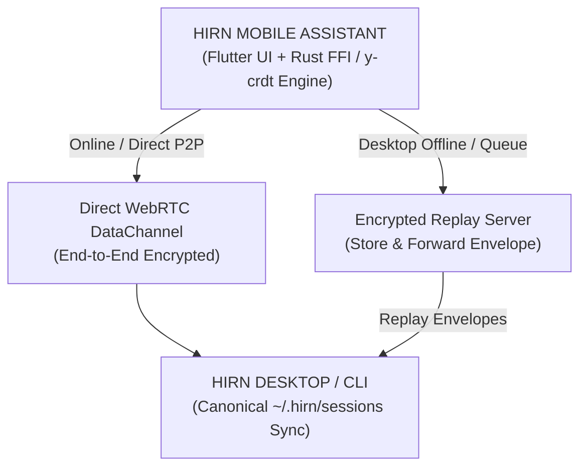

## Real-Time CRDT & Encrypted P2P Synchronization

The **assistant** mobile app gives you full control over your hirn ecosystem anywhere in the world without exposing private data to third-party servers.



### 1. Conflict-Free Replicated Data Types (y-crdt)
Work offline in subways, on planes, or during network drops. All session history, pending tool calls, and user prompts are tracked locally using `y-crdt` state vectors. When devices reconnect, state merges automatically without data loss or manual conflict resolution.

### 2. End-to-End Encrypted Replay Queue
When your desktop computer is powered off or unreachable:
- The mobile app signs and encrypts state envelopes using SHA-256 / AES-GCM local keypairs.
- Envelopes are pushed to an open-source, zero-knowledge relay server (`https://agent.hirn-labs.com` or self-hosted).
- The relay server cannot decrypt payload contents or read metadata.
- As soon as your desktop comes back online, it fetches the queued envelopes, decrypts them locally, and replays the CRDT state vector.

## High-Performance Flutter + Rust Core

Built natively for Android and iOS using **Flutter** for UI responsiveness and **Rust FFI** for cryptographic operations, local storage, and CRDT math.

- **0 Open HTTP Ports:** Modular MCP Apps (`ext-apps`) run in mobile webviews using native scheme handlers (`WebViewAssetLoader` on Android, `WKURLSchemeHandler` on iOS) under `hirn://apps/<app-id>/index.html`.
- **Background Push & Offloading:** Receive instant notifications when background agent tasks complete, or offload heavy compute tasks to local hirn servers when connected.
- **Self-Hostable Infrastructure:** The signaling and encrypted message replay server is 100% open-source and easy to host on any VPS:
  ```bash
  docker run -d -p 8080:8080 ghcr.io/hirnlabs/signaling:latest
  ```
