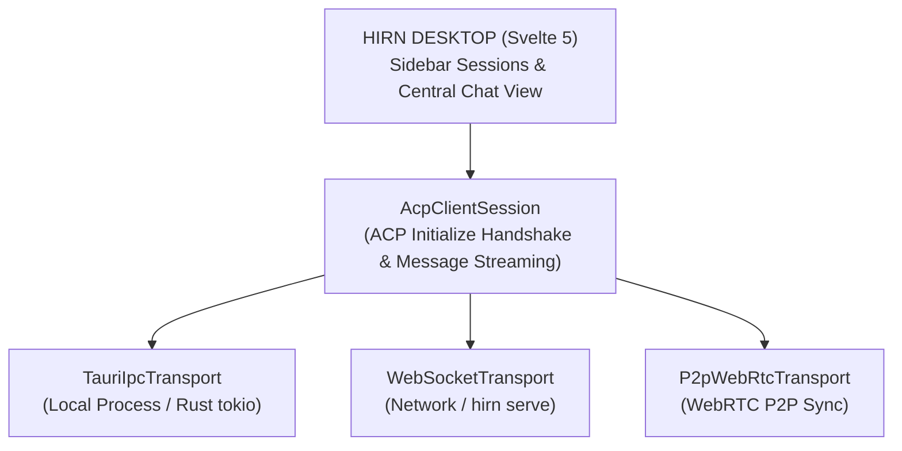

## High-Density Multi-Agent Workspace

Hirn Desktop provides a clean, minimal interface for orchestrating multiple Agent Client Protocol (ACP) agent sessions simultaneously, whether running locally on your workstation, across your local network, or over encrypted P2P connections.

- **Non-Blocking Background Execution:** Switch between agent sessions seamlessly while background agents continue thinking, streaming responses, or running tools.
- **Session Lifecycle Indicators:** Clear real-time status badges for `idle`, `working` (pulsing status), `waiting_for_input` (permission approvals), and `error`.
- **Shared Session Storage:** All sessions are saved directly to disk at `~/.hirn/sessions/<session_id>.json`, sharing a single source of truth across CLI, Desktop, and Web.

## Dual-Mode Transport Architecture

Powered by an abstract `AcpTransport` interface, the desktop UI seamlessly switches between execution modes without changing UI components:



- **Tauri IPC Transport (`TauriIpcTransport`):** Executes local ACP agent binaries directly via Rust `tokio::process` pipes (`stdin`/`stdout`), emitting newline-delimited JSON (NDJSON) over Tauri IPC.
- **WebSocket Bridge (`WebSocketTransport`):** Connects to `hirn serve` or remote network endpoints on `ws://` / `wss://` for browser-based workflows.
- **P2P WebRTC Sync (`P2pWebRtcTransport`):** Enables encrypted peer-to-peer agent connections with store-and-forward message queuing across devices.

## Sandboxed MCP Tool Host (`hirn://`)

Hirn Desktop acts as a modular host for interactive tool UIs (MCP Apps). Using custom native URI schemes (`tauri::UriScheme`), local app bundles are served securely under `hirn://apps/<app-id>/index.html` with zero open HTTP ports, preventing network exposure while allowing rich client-side rendering.

## Installation & Deployment

### Native Desktop Installers

Pre-built native installers are available from GitHub Releases:

- **Windows:** `.msi` or `.exe` installer.
- **macOS:** `.dmg` disk image.
- **Linux:** `.AppImage` or `.deb` package.

### Standalone Web Container (Docker)

Deploy the Svelte 5 Web Client as a lightweight container:

```bash
docker run -d \
  -p 80:80 \
  --name hirn-web \
  ghcr.io/hirnlabs/desktop-web:latest
```
