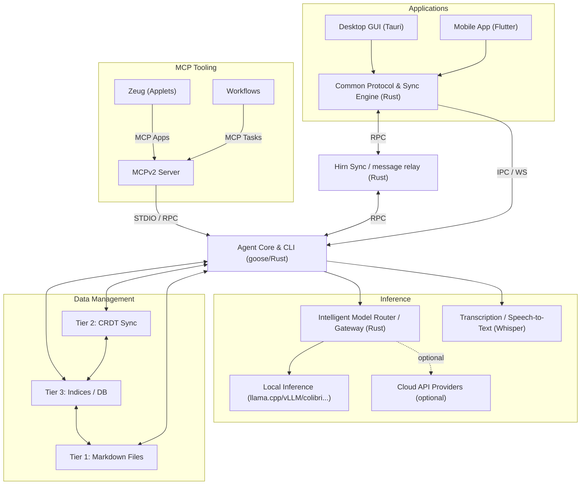

## Install

Hirn supports macOS, Linux, and Windows. You can run the full-featured Desktop GUI or the standalone Agent CLI (or both).

### Desktop Application (GUI)

Download pre-built desktop installers for your operating system directly from [GitHub Releases](https://github.com/hirnlabs/hirn/releases/latest):

- **macOS:** Download `.dmg` disk image.
- **Windows:** Download `.exe` or `.msi` installer.
- **Linux:** Download `.AppImage` or `.deb` package.

> **Automatic Updates:** Desktop installations automatically check for updates on startup, download release updates in the background, and prompt to restart.

---

### Agent CLI (Headless / Standalone)

The Hirn Agent is a Rust-based ACP orchestration engine and CLI tool based on the goose agent by the Agentic AI Foundation.

```bash
# macOS / Linux / WSL2
curl -fsSL https://raw.githubusercontent.com/hirnlabs/hirn/main/agent/setup/install.sh | bash
```

```powershell
# Windows PowerShell
irm https://raw.githubusercontent.com/hirnlabs/hirn/main/agent/setup/install.ps1 | iex
```

---

### Standalone Web Client (Docker)

Deploy the Web Client as a lightweight Nginx/SvelteKit Docker container:

```bash
docker run -d \
  -p 80:80 \
  --name hirn-web \
  ghcr.io/hirnlabs/desktop-web:latest
```

---

## Quick start

### 1. Verify Setup & Configure Models
```bash
hirn doctor
hirn configure
```

### 2. Launch Terminal Sessions
```bash
# Interactive Chat Session
hirn session

# Terminal UI (TUI)
hirn tui
```

### 3. Connect Desktop & Web Bridge
Launch the **Hirn Desktop App** for multi-agent chat, non-blocking background execution, interactive tool UIs (`ext-apps`), and encrypted WebRTC P2P sync.

```bash
hirn desktop
```

To start an ACP server over WebSocket and HTTP for Web Client or remote tool connections:
```bash
hirn serve
```

---

## How it fits together

Hirn connects desktop apps, terminal interfaces, mobile clients, and local inference servers through an intelligent router and encrypted P2P signaling network with zero cloud lock-in:



- **Desktop Host:** Tauri v2 + SvelteKit multi-agent host with dual-mode transports (Tauri IPC, WebSocket, WebRTC P2P) and sandboxed interactive tool UIs (`ext-apps`).
- **Agent CLI:** Rust-based ACP orchestration engine, terminal UI (`tui`), and WebRTC ACP relay server.
- **Router & Server:** Intelligent local-first gateway routing prompts based on task complexity and VRAM/hardware capability across local llama.cpp / vLLM backends, local Whisper transcription, and optional cloud model providers.
- **Signaling & Relay Server:** Minimal Rust WebRTC server providing encrypted P2P synchronization and store-and-forward message queuing for async offline delivery across devices.
- **Storage Hierarchy (Tier 1-3):** Canonical human-readable files (Markdown/JSON), binary CRDT collaboration overlays, and SQLite, Grafeo graph knowledge, and Vector DB queryable indices.
- **Assistant & Transcribe:** Mobile companion app (Flutter + Rust Sync Core) and local privacy-first speech-to-text engine using Whisper.

---

## Security & Privacy

- **100% Local-First:** Sessions and configurations are persisted locally in `~/.hirn` and your file system. No unexpected cloud telemetry.
- **Sandboxed Tool UIs:** Interactive extension UIs run in isolated, sandboxed views with zero open HTTP ports.
- **Encrypted Relay:** WebRTC P2P sync uses encrypted store-and-forward message queues for secure inter-device communication.
- **Configurable Endpoints:** Swap signaling and relay endpoints to self-hosted instances seamlessly across Desktop UI, Agent CLI, and Mobile Assistant.
